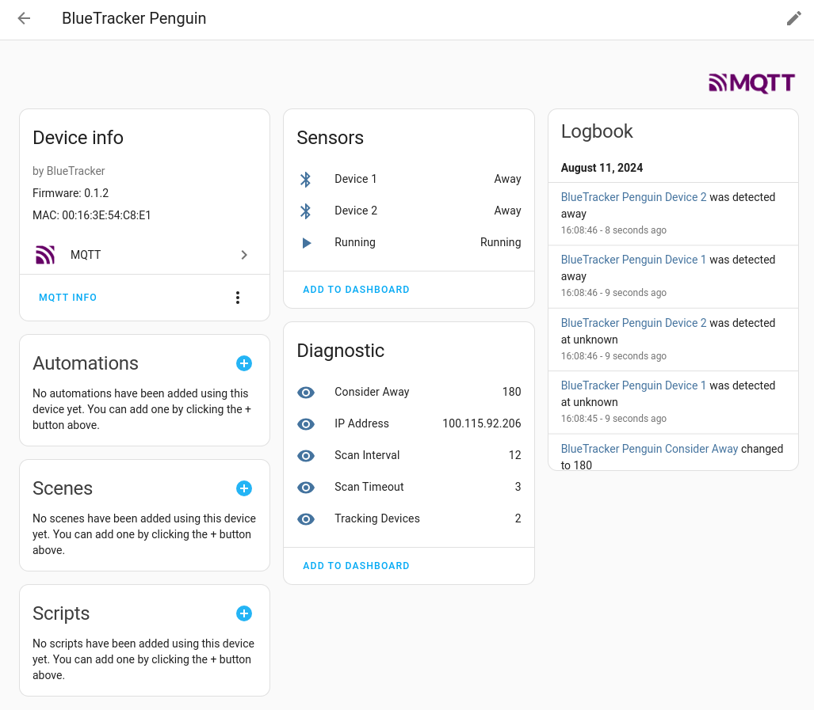
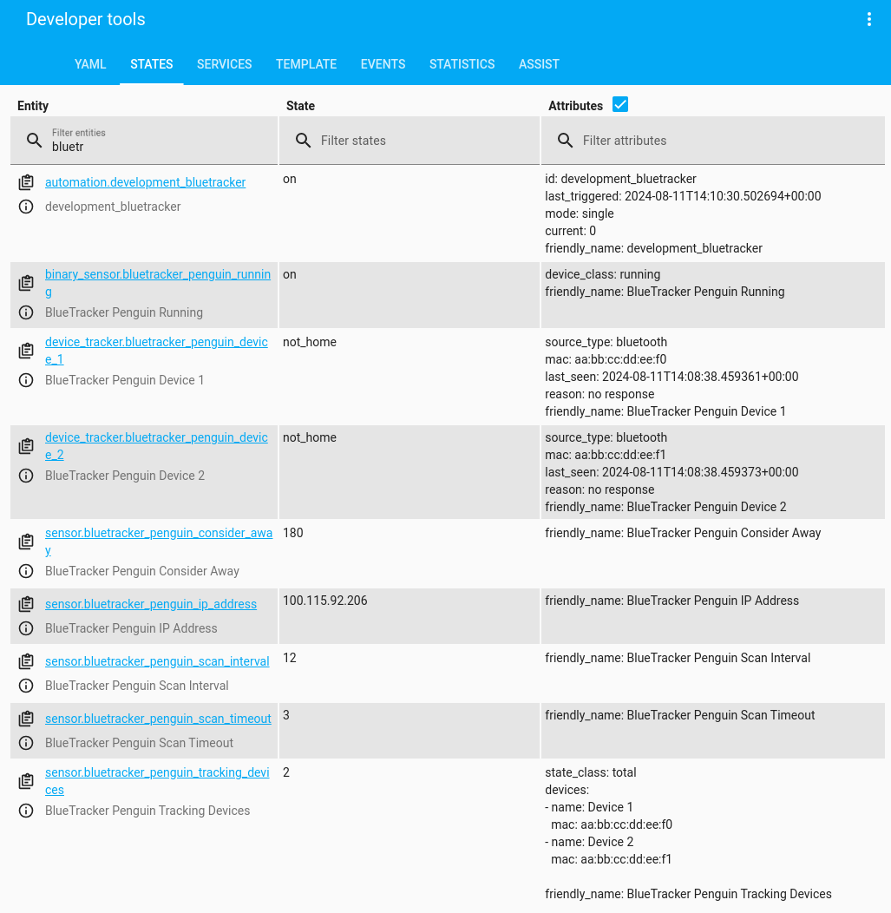

BlueTracker
===========

.. image:: https://github.com/essel-dev/bluetracker/actions/workflows/tests.yml/badge.svg
    :target: https://github.com/essel-dev/bluetracker/actions/workflows/tests.yml

.. image:: https://github.com/essel-dev/bluetracker/actions/workflows/pypi.yml/badge.svg
    :target: https://github.com/essel-dev/bluetracker/actions/workflows/pypi.yml

|

.. include_intro_start

Monitor nearby Bluetooth Classic devices and seamlessly integrate them into your
Home Assistant setup via MQTT, even with a modest Raspberry Pi Zero W.

.. include_intro_end

See it in action:

|

Resources
---------

- `BlueTracker @ Read the Docs <https://bluetracker.readthedocs.io/>`_
- `BlueTracker @ PyPI <https://pypi.org/project/bluetracker/>`_
