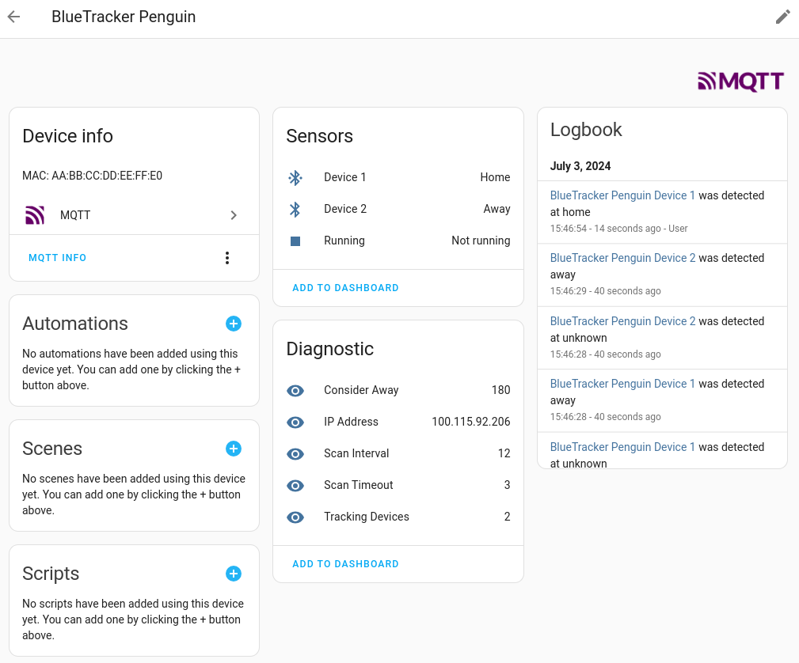
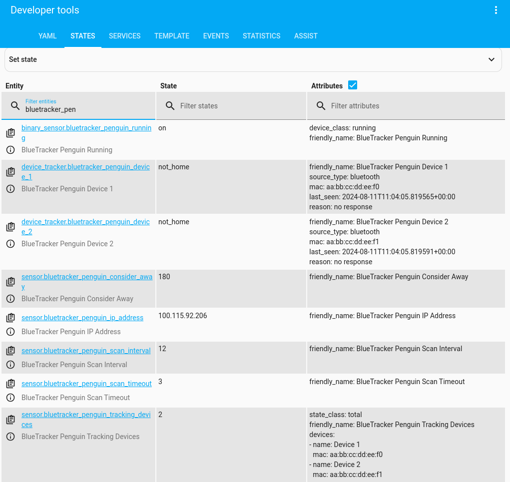

.. BlueTracker documentation master file, created by
  sphinx-quickstart on Mon Mar 18 10:55:29 2024.
  You can adapt this file completely to your liking, but it should at least
  contain the root `toctree` directive.

BlueTracker Documentation
=========================

Track Bluetooth Classic devices and send updates to Home Assistant through MQTT.

Example screenshots of Bluetooth Classic devices in Home Assistant:

|

Contents
--------

.. toctree::
  :maxdepth: 3

  installation
  configuration
  entities
  reference